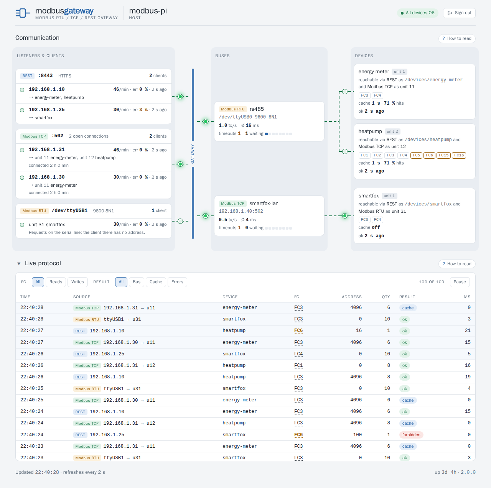

# modbusgateway – Deutsche Kurzfassung

🇬🇧 [Full documentation in English](README.md)

  

**modbusgateway bringt Modbus-Geräte ins Netzwerk: eine HTTPS-REST-API und ein Modbus-RTU⇄TCP-Gateway
für den Raspberry Pi, mit einer Warteschlange pro Bus.**

Stromzähler, Wärmepumpen, Wechselrichter und PV-Regler sprechen Modbus – viele davon über eine
serielle RS485-Leitung, die nur ein einziger Rechner erreicht. modbusgateway läuft auf dem Raspberry
Pi an dieser Leitung und macht die Geräte im ganzen Heimnetz nutzbar:

- über eine **REST-API** per HTTPS mit API-Key, z. B. für Node-RED, Home Assistant, ioBroker oder ein
  `curl` im Skript,
- über einen **Modbus-TCP-Eingang**: Modbus-TCP-Clients erreichen die Geräte am seriellen Bus – das
  klassische RTU-auf-TCP-Gateway,
- über einen **Modbus-RTU-Eingang**: Ein Client an einer seriellen Leitung – etwa ein Wechselrichter,
  der einen Zähler an RS485 erwartet – erreicht ein Gerät, das nur Modbus TCP spricht,
- mit **einer Warteschlange pro Bus**: Egal wie viele Clients gleichzeitig fragen, die langsame
  serielle Leitung sieht eine Anfrage nach der anderen, Schreibbefehle zuerst und in Reihenfolge;
  Leseanfragen kommen aus einem **kurzlebigen Cache**, gleiche Anfragen teilen sich einen Buszugriff.

Eine eingebaute **Webseite** zeigt, wer mit dem Gateway spricht: die Clients je Eingang, die Busse
mit ihren Geräten und ein Live-Protokoll der letzten Anfragen – ohne Registerwerte.

Pro Gerät legt `functions` fest, welche Function Codes erlaubt sind (`FC1`–`FC6`, `FC15`, `FC16`) –
ohne Angabe nur lesen. Keine Cloud, keine Datenbank: ein einzelnes Programm und eine YAML-Datei.

## In fünf Schritten

1. **Herunterladen:** Das Archiv für deinen Pi gibt es unter
   [Releases](https://github.com/womat/modbusgateway/releases/latest): `armv6` für Pi 1 und Zero
   (läuft auf jedem Pi), `armv7` für 32-Bit-Systeme, `arm64` für 64-Bit-Systeme.
2. **Installieren:** System-User `modbusgateway` anlegen und der Gruppe `dialout` hinzufügen (Zugriff
   auf die serielle Schnittstelle), Programm und `config.yaml` nach `/opt/modbusgateway` kopieren,
   Zertifikat erzeugen.
3. **Konfigurieren:** API-Key, unter `buses` die Verbindungen (serielle Schnittstelle oder TCP),
   unter `devices` ein Eintrag pro Gerät mit Bus und Unit-ID, auf Wunsch `gateway` für den
   Modbus-Eingang und unter `listen` die Modbus-Eingänge – ein vorhandener Block schaltet ihn ein.
4. **Starten:** als systemd-Dienst.
5. **Lesen:** `GET https://<dein-pi>:8443/devices/<gerät>/holding-registers/<adresse>?quantity=N` mit
   dem Header `X-Api-Key`, oder per Modbus TCP an Port 1502.

**Modbus hat keine Authentifizierung:** Wer den Modbus-TCP-Eingang erreicht, kann alle Function Codes
nutzen, die die Geräte erlauben. Den Eingang daher an eine vertrauenswürdige Schnittstelle binden
oder per Firewall schützen.

Die genauen Befehle stehen im [Quick start](README.md#quick-start), alle Einstellungen unter
[Configuration](README.md#configuration), Beispiele für Node-RED und Home Assistant unter
[Node-RED and Home Assistant](README.md#node-red-and-home-assistant).

## Lizenz

MIT, siehe [`LICENSE`](LICENSE).
