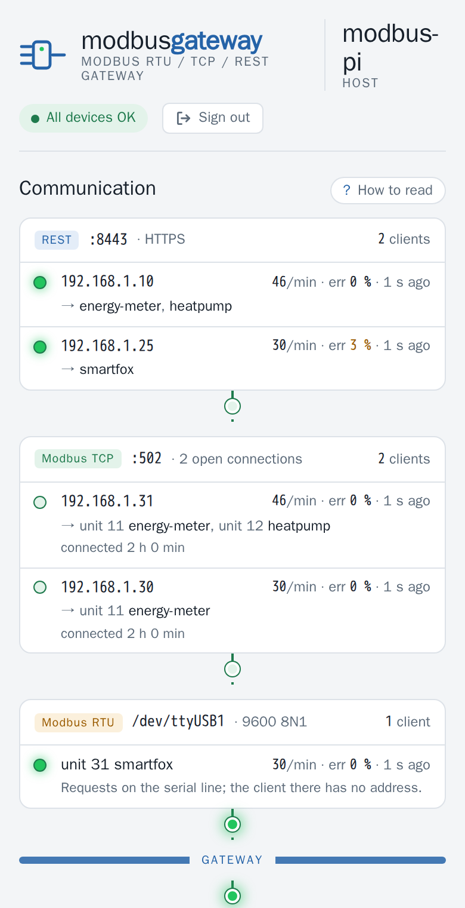
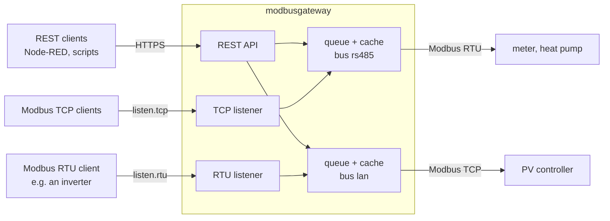

# modbusgateway

**Put your Modbus devices on the network: an HTTPS REST API and a Modbus RTU ⇄ TCP gateway for a
Raspberry Pi, with one queue per bus.**

[](https://github.com/womat/modbusgateway/actions/workflows/ci.yml)
[](https://github.com/womat/modbusgateway/releases/latest)
[](LICENSE)
[](go.mod)


🇩🇪 [Deutsche Kurzfassung](README.de.md)

<p align="center">
  <picture>
    <source media="(prefers-color-scheme: dark)" srcset="docs/screenshots/web-ui-dark.png">
    
  </picture>
  &nbsp;
  
</p>

> **Got a meter or a heat pump on RS485?** The [Quick start](#quick-start) gets you from download to
> the first register read in about ten minutes.

Energy meters, heat pumps, inverters and PV controllers speak Modbus - many of them over a serial
RS485 line that only one computer can reach. modbusgateway runs on the Raspberry Pi at that line and
makes the devices usable from everywhere on your network:

- a **REST API** over HTTPS with an API key, for Node-RED, Home Assistant, ioBroker, openHAB or a
  `curl` in a script,
- a **Modbus TCP listener**, so Modbus TCP clients reach the devices on the serial bus - a classic
  RTU-to-TCP gateway,
- a **Modbus RTU listener**, so a client on a serial bus - an inverter or a heat pump that expects a
  meter on RS485 - reaches a device that only speaks Modbus TCP,
- **one queue per bus**: however many clients ask at the same time, the slow serial line sees one
  request after the other, writes first, and reads are answered from a **short-lived cache**.

No cloud, no database, no runtime: a single binary, configured with one YAML file.

---

## Features

- **REST API** (HTTPS, API key, IP allowlist/blocklist) for FC1-FC6, FC15 and FC16
- **Modbus TCP listener** for the devices on serial buses, **Modbus RTU listener** for the devices on
  TCP, function codes FC1-FC6, FC15, FC16
- **One worker per bus**: never two requests on the wire at the same time; writes keep their order
  and go before waiting reads; a full queue answers "busy" instead of piling up
- **Read cache** per device (`cacheTTL`), parts of a cached block included; identical reads that wait
  at the same time share one bus transaction; a write drops the cached values it changes
- **Allowed function codes per device** (`functions`), the same on every interface - reading only
  unless configured otherwise
- **Several devices per bus**, unit IDs on the listeners independent of the addresses on the bus
- An **exception** of a device is passed on unchanged and keeps the connection; a transport error
  reconnects and retries once
- **Web page** that shows who talks to the gateway: the clients per listener, the buses with their
  devices, and a live protocol of the last transactions - no register values, embedded in the binary
- **Hot reload** of the configuration via `SIGHUP`
- Optional **Swagger UI** (build tag `swagger`, dev only)

## Quick start

**1. Download** the archive for your Pi from the [latest release](https://github.com/womat/modbusgateway/releases/latest):

| Archive        | Raspberry Pi model                                    |
|----------------|-------------------------------------------------------|
| `linux_armv6`  | Pi 1 and Zero (1st gen); also runs on every newer Pi |
| `linux_armv7`  | Pi 2 / 3 / 4 / 5 / Zero 2 W with a 32-bit OS          |
| `linux_arm64`  | Pi 3 / 4 / 5 / 400 / Zero 2 W with a 64-bit OS        |

```sh
VERSION=2.0.0 ARCH=armv6        # see the release page for the latest version
BASE=https://github.com/womat/modbusgateway/releases/download/v$VERSION
curl -LO $BASE/modbusgateway_${VERSION}_linux_$ARCH.tar.gz -LO $BASE/checksums.txt
sha256sum -c checksums.txt --ignore-missing
tar xzf modbusgateway_${VERSION}_linux_$ARCH.tar.gz
```

**2. Install** binary, example configuration and a certificate:

```sh
sudo groupadd -r -f modbusgateway
sudo useradd -r -s /usr/sbin/nologin -g modbusgateway modbusgateway
sudo usermod -aG dialout modbusgateway      # serial ports such as /dev/ttyS0, /dev/ttyUSB0
sudo mkdir -p /opt/modbusgateway/{bin,etc}

sudo install -m 755 modbusgateway /opt/modbusgateway/bin/
sudo install -m 640 config/config.yaml /opt/modbusgateway/etc/
sudo openssl req -x509 -nodes -newkey rsa:2048 -days 825 \
  -keyout /opt/modbusgateway/etc/key.pem -out /opt/modbusgateway/etc/cert.pem -subj "/CN=$(hostname)"
sudo chown -R modbusgateway:modbusgateway /opt/modbusgateway
```

**3. Configure** `/opt/modbusgateway/etc/config.yaml`: set `env: prod`, a random `apiKey`
(`openssl rand -hex 24`), your buses and one entry per device - see [Configuration](#configuration).
A minimal setup with one meter on the Pi's UART:

```yaml
buses:
  uart:
    type: rtu
    timeout: 1500ms
    rtu: { port: /dev/ttyS0, baudRate: 9600 }
devices:
  meter:
    bus: uart
    unitId: 2
    functions: [FC3]
```

**4. Start** it as a service and open the firewall:

```sh
sudo tee /etc/systemd/system/modbusgateway.service > /dev/null <<'EOF'
[Unit]
Description=modbusgateway - Modbus devices on the network
After=network-online.target
Wants=network-online.target

[Service]
User=modbusgateway
Group=modbusgateway
Type=simple
ExecStart=/opt/modbusgateway/bin/modbusgateway
ExecReload=/bin/kill -HUP $MAINPID
Restart=on-failure
RestartSec=5

[Install]
WantedBy=multi-user.target
EOF

sudo systemctl daemon-reload
sudo systemctl enable --now modbusgateway
sudo ufw allow 8443/tcp          # if ufw is active; 1502/tcp for the Modbus TCP listener
journalctl -u modbusgateway -n 20     # "Module started successfully"
```

A Modbus TCP listener on the standard port 502 needs `AmbientCapabilities=CAP_NET_BIND_SERVICE` in
`[Service]`; the default port 1502 does not.

**5. Read** the first registers:

```sh
curl -k -H "X-Api-Key: your-api-key" \
  "https://my-pi:8443/devices/meter/holding-registers/4096?quantity=2"
```

---

## How it works



| Client                     | Device on | Interface                                   |
|----------------------------|-----------|---------------------------------------------|
| REST                       | RTU bus   | `GET`/`PUT /devices/{device}/...`           |
| REST                       | TCP bus   | `GET`/`PUT /devices/{device}/...`           |
| Modbus TCP                 | RTU bus   | `listen.tcp`, unit ID from `gateway.unitId` |
| Modbus RTU (client on bus) | TCP bus   | `listen.rtu`, unit ID from `gateway.unitId` |

A Modbus listener offers the devices of the other transport only: Modbus TCP to Modbus TCP is not
needed, and a serial device is not offered on another serial line.

### Queue and cache

All requests to a bus - from the REST API and from the Modbus listeners - run one after the other in
one worker per bus:

- **Writes** are executed in the order they arrive, before reads that are still waiting.
- **Reads** are answered from the cache while an entry is younger than `cacheTTL` of the device; a
  read of a part of a cached block is answered from it too. Identical reads that wait at the same
  time share one bus transaction.
- A **write** drops the cached values of the same unit and table that it overlaps, so the next read
  sees the new value.
- A request that waited **longer than 10 s** is dropped without reaching the bus (REST 504, Modbus
  exception 11); a **full queue** answers at once (REST 503, Modbus exception 6).
- An **exception** of the device keeps the connection; a transport error closes it and retries the
  request once on a new connection.

---

## Node-RED and Home Assistant

**Node-RED** - an `inject` node every 5 s, an `http request` node and a `function` node that decodes
the registers:

- `http request`: method `GET`, URL
  `https://my-pi:8443/devices/meter/holding-registers/4096?quantity=59`, return a parsed JSON object,
  header `X-Api-Key`, and a TLS configuration without certificate verification for the self-signed
  certificate.
- `function`:

  ```js
  const buf = Buffer.from(msg.payload.dataHex, "hex");
  msg.payload = {
      voltageL1: buf.readUInt32BE(0) / 1000,   // registers 4096/4097, high word first
      power:     buf.readUInt32BE(40) / 100,
  };
  return msg;
  ```

Requests from several flows to the same bus are queued and cached by the gateway, so a dashboard and
a logger can poll the same meter without disturbing each other.

**Home Assistant** reaches the serial devices through the Modbus TCP listener with its built-in
[Modbus integration](https://www.home-assistant.io/integrations/modbus/): `type: tcp`, the Pi as
`host`, port `1502`, and the device's `gateway.unitId` as the address of each sensor.

---

## REST API

| Method | Path                                                       | Auth    | Description                               |
|--------|------------------------------------------------------------|---------|-------------------------------------------|
| GET    | `/`                                                        | —       | [Web page](#web-page); it asks for the API key and reads the endpoints below |
| GET    | `/version`                                                 | —       | Application name and version              |
| GET    | `/health`                                                  | API key | Runtime health information                |
| GET    | `/devices`                                                 | API key | Status of all configured devices          |
| GET    | `/devices/{device}/status`                                 | API key | Status of one configured device           |
| GET    | `/activity`                                                | API key | Listeners, clients, buses and the last 100 transactions |
| GET    | `/devices/{device}/coils/{address}?quantity=N`             | API key | Read coils (`FC1`)                        |
| GET    | `/devices/{device}/discrete-inputs/{address}?quantity=N`   | API key | Read discrete inputs (`FC2`)              |
| GET    | `/devices/{device}/holding-registers/{address}?quantity=N` | API key | Read holding registers (`FC3`)            |
| GET    | `/devices/{device}/input-registers/{address}?quantity=N`   | API key | Read input registers (`FC4`)              |
| PUT    | `/devices/{device}/coils/{address}`                        | API key | Write coils (`FC5` or `FC15`)             |
| PUT    | `/devices/{device}/holding-registers/{address}`            | API key | Write holding registers (`FC6` or `FC16`) |

Authentication via the `X-API-Key` header. Addresses are 0-based, decimal or `0x`-prefixed hex; for
a write the address is the start address.

A read answers `values` - one number per register (unsigned) or one `true`/`false` per coil or input
-, `dataHex` - the raw bytes as on the wire: two per register, high byte first; for coils and inputs
eight per byte, the first in the lowest bit - and `cached`, `true` when it came from the cache without
a bus transaction:

```json
{"device": "meter", "transport": "rtu", "unitId": 2, "functionCode": 3, "address": 4096,
 "addressHex": "0x1000", "quantity": 2, "values": [3, 35392], "dataHex": "00038A40",
 "duration": 0.041, "cached": false}
```

A write takes either `value` or `values`, and that picks the function code:

| Body                      | Coils  | Holding registers |
|---------------------------|--------|-------------------|
| `{"value": x}`            | `FC5`  | `FC6`             |
| `{"values": [x, y, ...]}` | `FC15` | `FC16`            |

`values` with a single element writes one value with `FC15`/`FC16` - for devices that accept only the
multiple-write function codes, which many do. The answer echoes the response of the device in
`dataHex`.

Errors are returned as `{"error": "..."}`:

| Status | Reason                                                     |
|--------|------------------------------------------------------------|
| 400    | invalid request, e.g. quantity 0 or above the Modbus limit, or a write body with neither or both of `value` and `values` |
| 403    | the function code is not in `functions` of the device      |
| 404    | the device is not configured                               |
| 502    | the device answered with an exception or did not answer    |
| 503    | the queue of the bus is full                               |
| 504    | the request waited longer than 10 s in the queue           |

`/devices/{device}/status` reports the bus, the allowed `functions`, whether the bus connection is
open, the last success and the last error (`lastError` and `lastErrorAt` stay until the next error;
compare with `lastSuccessAt`), the requests waiting on the bus (`queueLen`), the cache (`cacheTTL` in
seconds, `cacheHits`, `cacheMisses`) and, for a device offered on a Modbus listener, `gateway` with
the listener and the unit ID there.

`/activity` is what the web page draws: the listeners (`openConnections` for Modbus TCP), the
clients of the last 10 minutes with their requests per minute, errors and the devices they asked,
the buses with their transactions, errors, timeouts and mean duration, and the last 100
transactions with source, client, device, function code, address, quantity, result and duration. It
never holds register values.

```sh
curl -k -H "X-Api-Key: your-api-key" https://my-pi:8443/devices
curl -k -H "X-Api-Key: your-api-key" "https://my-pi:8443/devices/meter/input-registers/0x100?quantity=2"

# Writes need the function code in functions of the device
curl -k -X PUT -H "X-Api-Key: your-api-key" -H "Content-Type: application/json" \
  -d '{"value":1234}' https://my-pi:8443/devices/heatpump/holding-registers/10                 # FC6
curl -k -X PUT -H "X-Api-Key: your-api-key" -H "Content-Type: application/json" \
  -d '{"values":[10,20,30]}' https://my-pi:8443/devices/heatpump/holding-registers/0x64        # FC16
curl -k -X PUT -H "X-Api-Key: your-api-key" -H "Content-Type: application/json" \
  -d '{"value":true}' https://my-pi:8443/devices/heatpump/coils/5                              # FC5
curl -k -X PUT -H "X-Api-Key: your-api-key" -H "Content-Type: application/json" \
  -d '{"values":[true,false,true,true]}' https://my-pi:8443/devices/heatpump/coils/0x14        # FC15
```

---

## Web page

`https://<your-pi>:8443/` shows who talks to the gateway and refreshes every 2 seconds:

- **Listeners and clients**: one group per listener - REST, Modbus TCP, Modbus RTU - with its
  clients by IP address, their requests per minute, error share and the devices they asked. A
  client stays listed until 10 minutes after its last Modbus request, at most 8 per listener; REST
  counts calls of `/devices/…` only. The Modbus RTU listener is a fixed line and always shown; a
  serial line carries no client address, so its row names the devices asked.
- **Gateway, buses and devices**: every listener feeds the gateway, which queues each request on
  the bus of the addressed device. A bus shows its transactions per second, mean duration, timeouts
  and the waiting requests; each device hangs on the bus with its own tap. Every LED flashes once per
  request; a tap turns red after an error of its device.
- **Live protocol** (fold-out): the last 100 transactions - who asked which device for which
  function code and range, the result (`ok`, `cache`, an exception of the device, `timeout`,
  `forbidden`, ...) and the duration. Never the values.
- **Filters**: click a client, a bus, a device or a function code; the filters combine. Above the
  protocol, *FC* picks reads or writes and *Result* bus transactions, cache hits or errors.
- The state in the header names what is wrong: `All devices OK`, `heatpump: 3 timeouts`, or
  `rs485 disconnected`.

The page is part of the binary and loads nothing from the internet. It asks for the API key once and
keeps it in the browser (`localStorage`).

---

## Modbus listeners

A listener is active when its block under `listen` is present; delete or comment out the block to
turn it off.

- **`listen.tcp`** (`host`, `port`, default `0.0.0.0:1502`): Modbus TCP clients reach the devices on
  rtu buses that have a `gateway` block, as unit ID `gateway.unitId`.
- **`listen.rtu`** (`port`, `baudRate`, `dataBits`, `parity`, `stopBits`, `interFrameDelay`): the
  gateway answers as a Modbus RTU server on a serial port of its own - not the port of a bus - and a
  client on that line reaches the devices on tcp buses. The client's timeout must cover the round
  trip to the TCP device. `interFrameDelay` is the silence that ends a request (default t3.5 of the
  Modbus specification); USB adapters and the Raspberry Pi UART need 20-40 ms.

Function codes FC1-FC6, FC15 and FC16 are forwarded, limited by `functions` of the device; anything
else is answered with exception 1. A request for an unknown unit ID is answered with exception 11
over TCP and not at all over RTU, where another server on the line may own it. Broadcasts (unit
ID 0) are dropped, so a write cannot reach every device at once.

> **Modbus has no authentication.** Anyone who reaches `listen.tcp` can use every function code the
> devices allow. Bind it to a trusted interface (`host`) or protect it with a firewall.

---

## Configuration

Default path: `/opt/modbusgateway/etc/config.yaml`; `--config` or the environment variable
`CONFIG_FILE` choose another file. `${VAR}` is replaced with the environment variable `VAR` - only
this form, a bare `$` stays as it is - e.g. `apiKey: ${MODBUSGATEWAY_API_KEY}`. Unknown keys are an
error, so a misspelled key cannot silently fall back to its default; keys of earlier releases fail
with the new name.

The configuration has three parts: **buses** are the physical connections, **devices** sit on a bus,
and **listen** configures the Modbus listeners. The example in
[`config/config.yaml`](config/config.yaml):

```yaml
buses:
  rs485:
    type: rtu
    timeout: 1500ms
    rtu: { port: /dev/ttyUSB0, baudRate: 9600, dataBits: 8, parity: N, stopBits: 1 }
  smartfox-lan:
    type: tcp
    timeout: 2s
    tcp: { host: smartfox.example.lan, port: 502 }

devices:
  fronius-smartmeter:
    description: Main power meter
    bus: rs485
    unitId: 1
    functions: [FC3, FC4]
    cacheTTL: 1s
    gateway: { unitId: 11 }
  heatpump:
    description: Heat pump controller
    bus: rs485                  # same bus, same queue
    unitId: 2
    functions: [FC1, FC2, FC3, FC4, FC5, FC6, FC15, FC16]
    gateway: { unitId: 12 }
  smartfox:
    description: PV controller
    bus: smartfox-lan
    unitId: 1
    gateway: { unitId: 31 }     # a TCP device: offered on listen.rtu

listen:
  tcp: { host: 0.0.0.0, port: 1502 }
  # rtu: { port: /dev/ttyUSB1, baudRate: 9600, interFrameDelay: 20ms }
```

| Key | Type | Default | Description |
|-----|------|---------|-------------|
| `logLevel` | string | `info` | `debug`, `info`, `warn` or `error` |
| `logDestination` | string | `stdout` | `stdout`, `stderr` or a file path |
| `env` | string | `dev` | `prod` refuses to start without `certFile`; `dev` falls back to an embedded self-signed certificate |
| `webserver.listenHost`, `.listenPort` | string, int | `0.0.0.0`, `8443` | Address of the HTTPS API |
| `webserver.apiKey` | string | — | **Required.** Key for the `X-API-Key` header; a short or example key is logged as a warning |
| `webserver.certFile`, `.keyFile` | string | — | TLS certificate and key |
| `webserver.allowedIPs`, `.blockedIPs` | list | empty | Addresses or networks; empty `allowedIPs` allows all |
| `buses.<name>.type` | string | — | **Required.** `rtu` or `tcp` |
| `buses.<name>.timeout` | duration | — | **Required.** Response timeout of one request, e.g. `1500ms` |
| `buses.<name>.queueSize` | int | `64` | Requests that may wait on the bus; beyond, requests are "busy" |
| `buses.<name>.rtu` | block | — | `port` (required), `baudRate` `9600`, `dataBits` `8`, `parity` `N`/`E`/`O` (`N`), `stopBits` `1` |
| `buses.<name>.tcp` | block | — | `host` (required), `port` `502` |
| `devices.<name>` | block | — | The name is the device in the REST API |
| `devices.<name>.bus` | string | — | **Required.** Name of an entry in `buses` |
| `devices.<name>.unitId` | int | — | **Required.** Address of the device on its bus, 1-247, unique per bus |
| `devices.<name>.functions` | list | `[FC1, FC2, FC3, FC4]` | Allowed function codes: `FC1`-`FC6`, `FC15`, `FC16`; on the REST API and the listeners alike |
| `devices.<name>.cacheTTL` | duration | `1s` (rtu), `0s` (tcp) | How long a read is served from the cache; `0s` = no cache |
| `devices.<name>.gateway.unitId` | int | — | Offer the device on the listener of the other transport as this unit ID, 1-247, unique per listener |
| `listen.tcp` | block | off | `host` `0.0.0.0`, `port` `1502` |
| `listen.rtu` | block | off | `port` (required, not a bus port), `baudRate`, `dataBits`, `parity`, `stopBits` like a bus, `interFrameDelay` (t3.5) |

A serial port or a TCP endpoint belongs to one bus; put all devices behind it on that bus. The
`unitId` on the bus and `gateway.unitId` are independent: two buses may both have a device with
`unitId: 1`, and Modbus clients still tell them apart by their `gateway.unitId`.

---

## Reload, restart and stop

| Signal             | Effect                                                                                   |
|--------------------|------------------------------------------------------------------------------------------|
| `SIGHUP`           | Reload the configuration: buses, devices and listeners are set up again                  |
| `SIGTERM`/`SIGINT` | Graceful stop: the listeners and the HTTPS server close, then the bus connections        |

```sh
sudo systemctl reload modbusgateway     # SIGHUP
```

A reload never leaves the devices unreachable:

- The new file is loaded and validated **before** anything is torn down. A broken file is refused
  with `Config reload rejected` in the log, and the gateway keeps running with its current
  configuration.
- A file that is valid but cannot start - a missing certificate, a port or a serial line in use -
  is rolled back: everything the failed start opened is released, and the gateway starts again with
  the previous configuration (`Start with the new configuration failed, continuing with the previous
  one`).
- A web server that stops on its own restarts the gateway with the current configuration.

Only a configuration that fails on the very first start ends the process.

---

## Command-line Flags

| Flag        | Default                              | Description                     |
|-------------|--------------------------------------|---------------------------------|
| `--config`  | `/opt/modbusgateway/etc/config.yaml` | Path to the config file         |
| `--debug`   | `false`                              | Force `debug` logging to stdout |
| `--version` | `false`                              | Print version and exit          |
| `--about`   | `false`                              | Print app metadata and exit     |
| `--help`    | `false`                              | Print embedded help and exit    |

---

## TLS Certificate

The [Quick start](#quick-start) creates a self-signed certificate for the host name of the Pi. With
`env: dev` and no `certFile` the gateway falls back to an embedded development certificate; its key
ships in every release, so `env: prod` refuses to start without `certFile`. Browsers enforce a
maximum validity of 825 days.

---

## Backup & Restore

```sh
sudo tar czf /tmp/modbusgateway-backup.tar.gz /opt/modbusgateway

sudo tar xzf /tmp/modbusgateway-backup.tar.gz -C /
sudo chown -R modbusgateway:modbusgateway /opt/modbusgateway
sudo systemctl restart modbusgateway
```

---

## Releases

Every release on the [releases page](https://github.com/womat/modbusgateway/releases) carries
archives for all Raspberry Pi architectures with the binary, `config/config.yaml`, `README.md` and
`LICENSE`, plus a `checksums.txt` and a changelog. Versions follow
[semantic versioning](https://semver.org/); a breaking change of the API or the configuration raises
the major version.

`modbusgateway --version` reports the release a binary was built from. A local build reports
something like `2.0.0-3-g0c13781-dirty` instead, which is how the two are told apart on a device.

Building from source needs Go and `make`: clone the repository and run `make help` for the targets
(`make test` and `make lint` together run what CI checks);
[`CLAUDE.md`](CLAUDE.md) describes the architecture, the tests and the release process.

### Upgrading to 2.0.0

2.0.0 replaces the per-device connection settings with buses and adds the queue, the cache and the
Modbus listeners:

| 1.x                                                    | 2.0.0                                                 |
|--------------------------------------------------------|-------------------------------------------------------|
| `devices.<name>.transport`, `tcp`, `serial`, `timeout` | an entry in `buses`, referenced with `bus`            |
| `devices.<name>.deviceId`                              | `unitId`                                              |
| `devices.<name>.gatewayDeviceId`                       | `gateway: { unitId: N }`                              |
| `modbusServer: { enabled, listenHost, listenPort }`    | `listen: { tcp: { host, port } }`; block present = on |
| Modbus TCP gateway read-only (FC1-FC4)                 | FC1-FC6, FC15, FC16, limited by `functions`           |
| every function code on the REST API                    | `functions` of the device; default reading only       |
| `POST` writes; FC15/FC16 with the address in the body  | `PUT` with the start address in the path; `value` or `values` picks the function code |
| `$VAR` and `${VAR}` expanded                           | `${VAR}` only                                         |
| embedded certificate in every environment              | with `env: dev` only                                  |

An old configuration file is refused with a message that names the new key. The read paths stay
the same; reads gain `values` and `cached`, and the device status gains `bus`, `functions`,
`queueLen`, the cache (`cacheTTL`, `cacheHits`, `cacheMisses`), `lastErrorAt` and `gateway`;
`lastError` now stays until the next error instead of clearing on success. New: the web page at `/`
and `GET /activity`. Release 1.0.10 and earlier (`mbgw`, `/readholdingregisters`) have a different API.

---

## License

modbusgateway is released under the MIT License - see [`LICENSE`](LICENSE) for the full text.

### Third-party licenses

The source tree contains no third-party code, but a **compiled binary statically links** the
modules below. Their terms apply to anyone distributing that binary, not to the sources here.

| Module                                            | License                |
|---------------------------------------------------|------------------------|
| `github.com/simonvetter/modbus`                   | MIT                    |
| `github.com/womat/mbserver`                       | MIT                    |
| `github.com/womat/golib`                          | MIT                    |
| `github.com/goburrow/serial`                      | MIT                    |
| `go.bug.st/serial`                                | BSD-3-Clause           |
| `github.com/golang-jwt/jwt/v5`                    | MIT                    |
| `gopkg.in/yaml.v3`                                | MIT and Apache-2.0     |
| `golang.org/x/sys`                                | BSD-3-Clause           |
| Swagger UI build only (`-tags swagger`):          |                        |
| `github.com/swaggo/swag`, `http-swagger`, `files` | MIT                    |
| `github.com/go-openapi/*`, `go.yaml.in/yaml/v3`   | Apache-2.0             |
| `github.com/KyleBanks/depth`                      | MIT                    |
| `golang.org/x/net`, `mod`, `sync`, `tools`        | BSD-3-Clause           |

All of these are permissive; none obliges modbusgateway to change its license.
